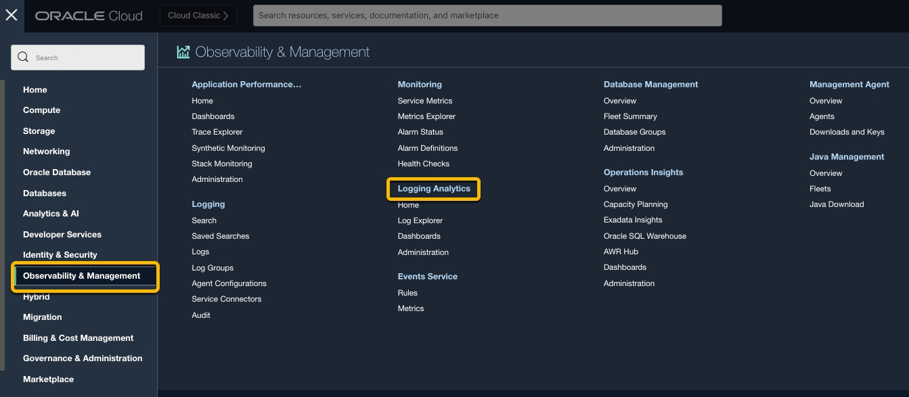
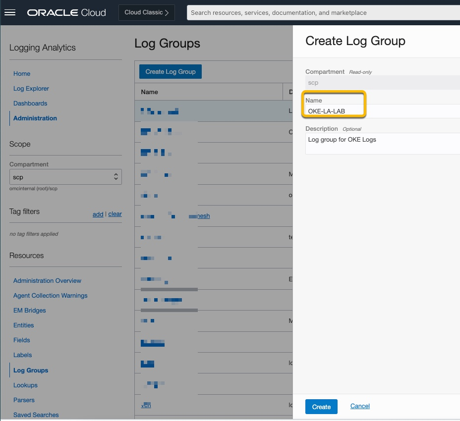
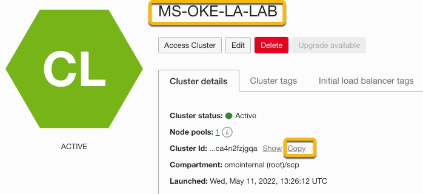

# LAB 2: Prerequisites for installing OKE HELM Charts


## Introduction

In this lab, you will onboard Logging Analytics (if you have not already done so previously), create a compartment (if you have not done sp previously) to isolate your resources, create a Logging Analytics log Group to define who has access to the logs and then gather information which will be needed later to configure the OKE HELM chart to enable logs to be sent to Logging Analytics.   

#### Estimated time: ?  

#### Objectives

*   On boarding Logging Analytics ¿ not DONE?
*   Create a Compartment ¿ not DONE
*   Create a Logging Analytics Log Group
*   Obtain and record information which will later be required in the values.yaml file, to send logs to Logging Analytics, specifically
    *   Logging Analytics Namespace
    *   Kubernetes Cluster Name and Cluster ID


#### Prerequisites
* This lab requires an [Oracle Cloud account](https://www.oracle.com/cloud/free/). You may use your own cloud account, or a Free Tier account, a cloud account that you obtained through a trial.
* The role of Oracle Cloud Account Administrator.

## Task 1: Onboarding Logging Analytics

If you are already using Logging Analytics then this task is not required.
Please view this [video](https://youtu.be/fm76C3R4kPM "link title")  and follow the steps below.

1. From the top level OCI console menu. Navigate to *Observability & Management* and click *Logging Analytics*.



2. On the next screen. Click *Start Using Logging Analytics*


3. Review the policies that are automatically created. A log group called Default is created if it does not exist. After Logging Analytics service is enabled successfully, click *Take me to Log Explorer*.

 


## Task 2: Creating a Log Group.
[Log Groups](https://docs.oracle.com/en-us/iaas/logging-analytics/doc/logging-analytics1.html#LOGAN-GUID-9B74BCD1-48BE-4A80-97E5-1C6CE9AA5EC2/) can be used to define who as access to the logs.

1. From the top level OCI console menu. *Navigate to Observability & Management* and click *Administration* under Logging Analytics.


2. From the Administration Overview page, under Administration Overview section on the left, select Log Groups.


3. From the Log Groups page select *Create Log Group*


4. From the Create Log Groups Page. Ensure your compartment is selected and enter a name and optional description for the log group.
````
<copy>OKE-LA-LAB</copy>
````


5. Once created the group should appear on the Log Groups page.


## Task 1: Obtain Logging Analytics Namespace

For logs to be sent to Logging Analytics the Logging Analyics Namespace is required. Here we will locate the Namespace and copy it to a safe location so that we can paste it into the values.yaml file later.  

1.  From the main menu click on Observability & Manageability, on the right under Logging Analytics click on Administration


2.  From the Administration Overview page on the left under Resources section, click on select **Service Details**


3.  Locate the Service Namespace. Copy the Service Namespace (in this case omcinternal) to a text file and save as you will need this later in the workshop

   
\*\*\*\*Above Image needs cropping \*\*\*\*  


## Task 2. Obtain the Kubernetes Cluster name and Cluster ID

1.  From the Main Menu go to **Developers Service** and then click on **Kubernetes Cluster (OKE)** on the right.

  


2.  From the next screen under Name, locate your Cluster Name and click on it.


3.  On the next screen locate the Cluster Name (in my case Ms-OKE-LA-LAB) and copy it to a text file. Also click **Copy** next to the Cluster ID and paste that value to a text file and save, as you will need these values later in the workshop.




## Task 3: Create a Log Group**

Why is the log group required?

1.  From the OCI menu, select **Observability and Manageability,** then **Administration** from the right side under Logging Analytics.


\*\*Need an image \*\*\*  

2.  From the **Logging** **Analytics Administration Page**, under Resources click on **Log Groups**


3.  Click **Create Log Group** on the Log Groups page, ensuring you are in the correct compartment. (My my case it's SCP). Enter a Name of the Log Group n(in this case OKE-LA-LAB) and optional Description. Then click **Create**.


4.  After the Log Group has been created click on it.


5.  Locate the OCID for the group and click **Copy.** Paste and save the OCID to a test file as you will need it later.


You may now [proceed to the next lab](#next).


## Acknowledgements
* **Author** - Ashwini R, Senior Member of Technical Staff
* **Contributors** -  Kumar Varun, Product Manager
* **Last Updated By/Date** - <Name, Group, Month Year>
