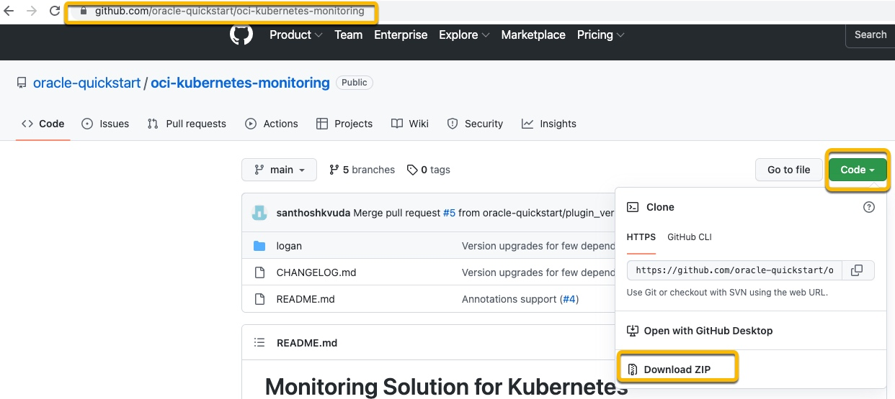
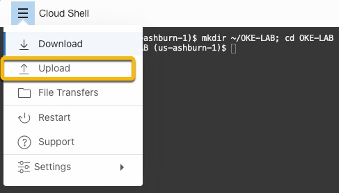
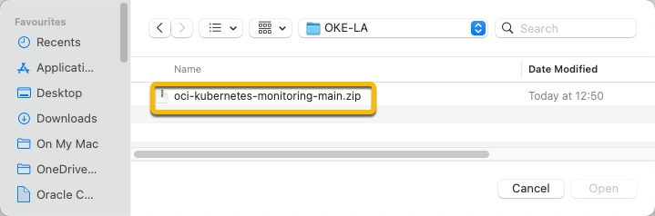
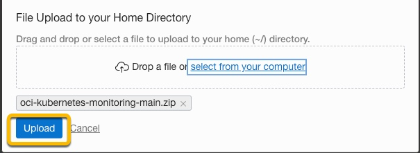
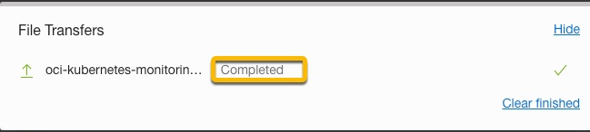
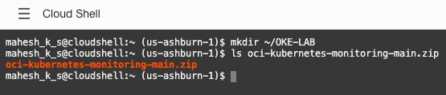
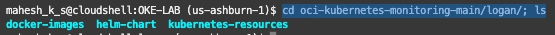
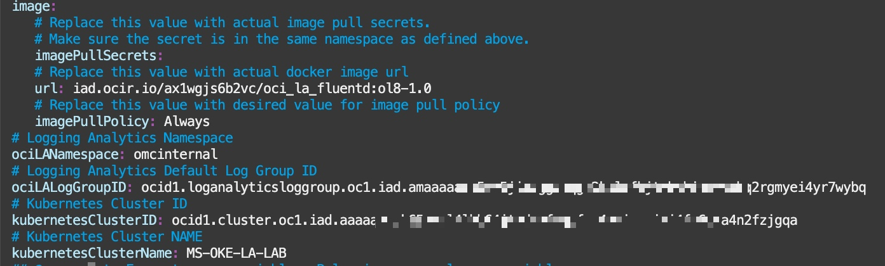

# LAB 3: Installing the OKE HELM Chart

## Introduction

*   Add details

Estimated time: ?  

##### Objectives

*   Download HELM
*   Install HELM
*   ?


##### Prerequisites

*   Ensure that Lab 2 – Prerequisites lab is completed
*   Also ?


## Task 1: Download HELM Chart.


##### Introduction

In this task we will download the Helm charts and ??  

1.  Go to [https://github.com/oracle-quickstart/oci-kubernetes-monitoring](https://github.com/oracle-quickstart/oci-kubernetes-monitoring)

In your browser
```
<copy>https://github.com/oracle-quickstart/oci-kubernetes-monitoring</copy>
 ```

2.  Press Code and download the Zip file to your local desktop




## Task 2: Upload the OCI-Kubernetes-monitoring-main.zip to the Cloud shell

1.  Open the Cloud Shell by clicking the **\>\_** icon from the top right corner in the Oracle Cloud console.


2.  From the Cloud Shell create a directory to store the downloaded file
```
<copy>mkdir ~/OKE-LAB</copy>  
```
3.  Click the navigation menu (three-bar icon) in the Cloud Shell title bar to open the menu. Then select **Upload**.



4.  Click **select from your computer** link and select the Java agent installer file from your computer. This is the file that you downloaded in the earlier steps.


  


5.  Click **Upload**.




6.  Wait for the file transfer to complete.




7.  Verify the file has been transferred to your cloud shell area.

```
<copy>ls oci-kubernetes-monitoring-main.zip</copy>  
```




## Task 3: Unzip download


1.  Move the zip file to OKE-LABS and unzip

```
<copy>
mv oci-kubernetes-monitoring-main.zip OKE-LAB/; cd OKE-LAB/; unzip oci-kubernetes-monitoring-main.zip</copy>
```

2.  Once unzipped, move into the following directories, where you will see three directory folders
```
<copy>
cd oci-kubernetes-monitoring-main/logan/; ls  </copy>
```



## Task 4: Configuring HELM Chart

In this section we will configure the values.yaml file with the information we obtained in the prerequires section.  

1.  Open Cloud shell
More Images and explanation required. How to get to cloud shell.

2.  Go to the location of the helm-chart.
```
<copy>
cd ~/OKE-LAB/oci-kubernetes-monitoring-main/logan/helm-chart</copy>
```

3.  Edit values.yaml.  I will be using vi.  Firstly, find the location **url:**
and add iad.ocir.io/ax1wgjs6b2vc/oci\_la\_fluentd:ol8-1.0
```
<copy>iad.ocir.io/ax1wgjs6b2vc/oci\_la\_fluentd:ol8-1.0</copy>
```
The full line should look like:
```
url: iad.ocir.io/ax1wgjs6b2vc/oci\_la\_fluentd:ol8-1.0
```

4. Within values.yaml locate the following lines and replace them with the information copied in the prerequisites (LAB2) section – ensure that the format of the file is not changed.

```
# Logging Analytics Namespace  
ociLANamespace:
# Logging Analytics Default Log Group ID  
ociLALogGroupID:
# Kubernetes Cluster ID  
kubernetesClusterID:
# Kubernetes Cluster NAME  
kubernetesClusterName:  
```
Once you have located the values above and populated with the information from Lab 2, the file should look similar to:
    For example:  
```
# Logging Analytics Namespace  
ociLANamespace: omcinternal
# Logging Analytics Default Log Group ID  
ociLALogGroupID: ocid1.loganalyticsloggroup.oc1.iad.amaaaa##############################2rgmyei4yr7wybq
# Kubernetes Cluster ID  
kubernetesClusterID: ocid1.cluster.oc1.iad.aaaa#########################################a4n2fzjgqa
# Kubernetes Cluster NAME  
kubernetesClusterName: MS-OKE-LA-LAB  
```

Please save the file.  Here is an example of my values.yaml file  


## Task 5: Install the helm chart.

Now that you have populated the values.yaml file. It's time to install the helm chart.  

1.  Copy and paste the following, ensuring ** add some more information so as not to confuse **
```
<copy> helm install okelab -values ~/OKE LAB/oci-kubernetes-monitoring-main/logan/helm-chart/values.yaml ~/OKE-LAB/oci- Kubernetes- monitoring-main/logan/helm-chart</copy>
```

The output should be similar to:  
```
mahesh_k_s@cloudshell:helm-chart(us-ashburn-1)$ helm install okelab --values ~/OKE- LAB/oci-kubernetes-monitoring-main/logan/helm-chart/values.yaml ~/OKE-LAB/oci- Kubernetes- monitoring-main/logan/helm-chart

WARNING: Kubernetes configuration file is group-readable. This is insecure. Location: /home/mahesh\_k\_s/.kube/config  
WARNING: Kubernetes configuration file is world-readable. This is insecure. Location: /home/mahesh\_k\_s/.kube/config  
NAME: okelab  
LAST DEPLOYED: Fri Jun 10 06:25:52 2022  
NAMESPACE: default  
STATUS: deployed  
REVISION: 1  
TEST SUITE: None  
```

## Task 6: Check the helm chart has been installed successfully


Now check the helm chart has been successfully installed. Copy and paste the following.  
```
<copy>
$ helm history okelab
</copy>
```

The output should be similar. Look for **Install complete** 
```
mahesh\_k\_s@cloudshell:helm-chart(us-ashburn-1)$ helm history okelab  
The output should be similar to:  
WARNING: Kubernetes configuration file is group-readable. This is insecure. Location:  
/home/mahesh\_k\_s/.kube/config  
WARNING: Kubernetes configuration file is group-readable. This is insecure. Location:  
/home/mahesh\_k\_s/.kube/config  
REVISION UPDATED STATUS CHART APP VERSION DESCRIPTION  
1 Fri Jun 10 06:25:52 2022 deployed oci-la-fluentd-1.0.2 2.0.3 Install complete
```

You may now [proceed to the next lab](#next).


## Acknowledgements
* **Author** - Ashwini R, Senior Member of Technical Staff
* **Contributors** -  Kumar Varun, Product Manager
* **Last Updated By/Date** - <Name, Group, Month Year>
