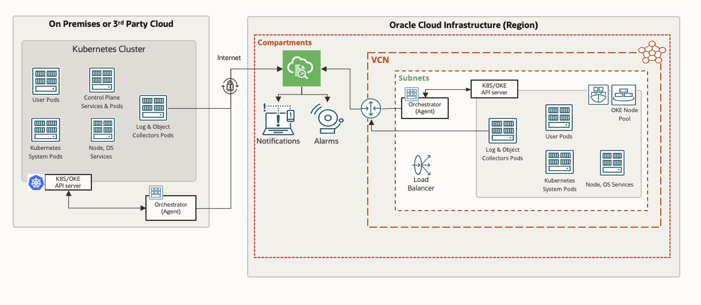

# Introduction

This workshop walks you through deploying Logging Analytics Kubernetes Monitoring Solution for Oracle OKE cluster. This monitoring solution is based on FluentD based Kubernetes Daemon set and Replica Sets for collecting Kubernetes platform logs, pods logs, and node logs. It also collects Kubernetes Object details on periodic basis. This workshop uses Oracle OKE for deployment for simplicity, but it can be similarly deployed for any Kubernetes environment.

### About Logging Analytics

Oracle Cloud Logging Analytics is a cloud solution in Oracle Cloud Infrastructure that lets you index, enrich, aggregate, explore, search, analyse , correlate, visualise and monitor all log data from your applications and system infrastructure

### Logging Analytics Kubernetes Monitoring Solution Architecture

## Objectives

*   In this workshop, you will
    *   Download an OKE Helm chart
    *   Apply changes to the Helm chart
    *   Install the OKE Helm chart
    *   View OKE logs in LA

## Prerequisites

*   An Oracle Free Tier with 30-day free trial or Paid Cloud Account
*   Oracle Cloud Account Administrator role to Create Log Groups within compartments (need a docs link)
*   Have the correct LA policies in place
*   Completion of the [**Migrating WebLogic Server to Kubernetes on OCI**](https://apexapps.oracle.com/pls/apex/dbpm/r/livelabs/workshop-attendee-2?p210_workshop_id=567&p210_type=2&session=102696148940850) workshop, Task 1 to Task 4.(Tasks 5 to 7 are not required for this workshop.)

You may now proceed to the [Getting Started lab](#next).

## Learn More

* [Blog](https://blogs.oracle.com)
* [Reference Architecture](ttps://docs.oracle.com/solutions/?q=&cType=reference-architectures&sort=date-desc&lang=en)
* [Product Documentation](https://docs.oracle.com/en-us/iaas/logging-analytics/index.html)

## Acknowledgements
* **Author** - Ashwini R, Senior Member of Technical Staff
* **Contributors** -  Kumar Varun, Product Manager
* **Last Updated** - January 12, 2022
